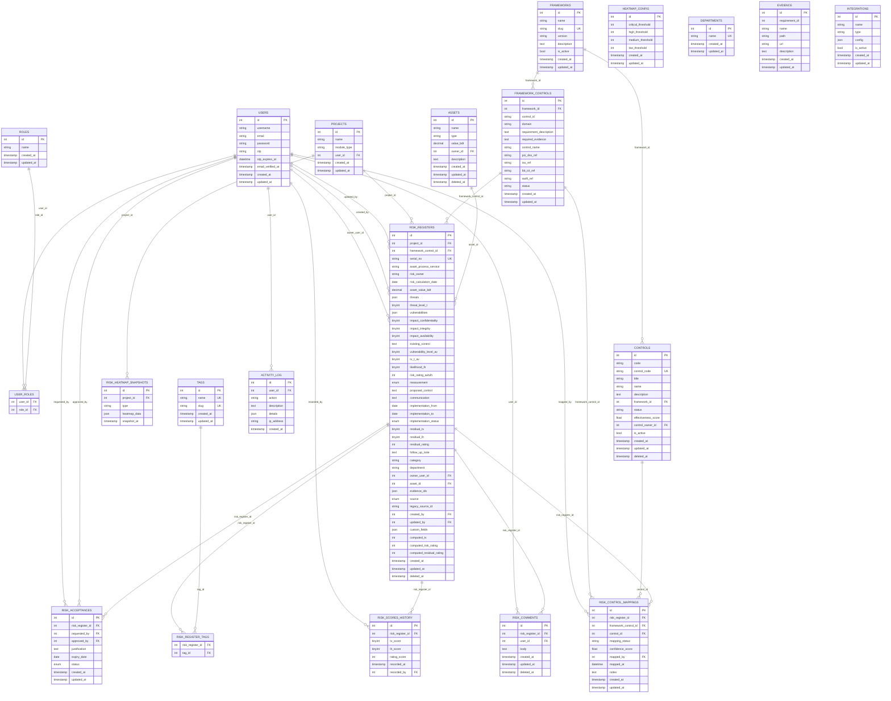

# ComplianceHub RMM — Entity Relationship Diagram

```mermaid
erDiagram
    USERS {
        int id PK
        string username
        string email
        string password
        string otp
        datetime otp_expires_at
        timestamp email_verified_at
        timestamp created_at
        timestamp updated_at
    }

    ROLES {
        int id PK
        string name
        timestamp created_at
        timestamp updated_at
    }

    USER_ROLES {
        int user_id FK
        int role_id FK
    }

    PROJECTS {
        int id PK
        string name
        string module_type
        int user_id FK
        timestamp created_at
        timestamp updated_at
    }

    RISK_REGISTERS {
        int id PK
        int project_id FK
        int framework_control_id FK
        string serial_no UK
        string asset_process_service
        string risk_owner
        date risk_calculation_date
        decimal asset_value_bdt
        json threats
        tinyint threat_level_t
        json vulnerabilities
        tinyint impact_confidentiality
        tinyint impact_integrity
        tinyint impact_availability
        text existing_control
        tinyint vulnerability_level_av
        tinyint tv_t_av
        tinyint likelihood_lh
        int risk_rating_avtvlh
        enum measurement
        text proposed_control
        text communication
        date implementation_from
        date implementation_to
        enum implementation_status
        tinyint residual_tv
        tinyint residual_lh
        int residual_rating
        text follow_up_note
        string category
        string department
        int owner_user_id FK
        int asset_id FK
        json evidence_ids
        enum source
        string legacy_source_id
        int created_by FK
        int updated_by FK
        json custom_fields
        int computed_tv
        int computed_risk_rating
        int computed_residual_rating
        timestamp created_at
        timestamp updated_at
        timestamp deleted_at
    }

    FRAMEWORKS {
        int id PK
        string name
        string slug UK
        string version
        text description
        bool is_active
        timestamp created_at
        timestamp updated_at
    }

    FRAMEWORK_CONTROLS {
        int id PK
        int framework_id FK
        string control_id
        string domain
        text requirement_description
        text required_evidence
        string control_name
        string pci_dss_ref
        string iso_ref
        string bb_ict_ref
        string swift_ref
        string status
        timestamp created_at
        timestamp updated_at
    }

    CONTROLS {
        int id PK
        string code
        string control_code UK
        string title
        string name
        text description
        int framework_id FK
        string status
        float effectiveness_score
        int control_owner_id FK
        bool is_active
        timestamp created_at
        timestamp updated_at
        timestamp deleted_at
    }

    RISK_CONTROL_MAPPINGS {
        int id PK
        int risk_register_id FK
        int framework_control_id FK
        int control_id FK
        string mapping_status
        float confidence_score
        int mapped_by FK
        datetime mapped_at
        text notes
        timestamp created_at
        timestamp updated_at
    }

    RISK_SCORES_HISTORY {
        int id PK
        int risk_register_id FK
        tinyint tv_score
        tinyint lh_score
        int rating_score
        timestamp recorded_at
        int recorded_by FK
    }

    HEATMAP_CONFIG {
        int id PK
        int critical_threshold
        int high_threshold
        int medium_threshold
        int low_threshold
        timestamp created_at
        timestamp updated_at
    }

    RISK_HEATMAP_SNAPSHOTS {
        int id PK
        int project_id FK
        string type
        json heatmap_data
        timestamp snapshot_at
    }

    ASSETS {
        int id PK
        string name
        string type
        decimal value_bdt
        int owner_id FK
        text description
        timestamp created_at
        timestamp updated_at
        timestamp deleted_at
    }

    DEPARTMENTS {
        int id PK
        string name UK
        timestamp created_at
        timestamp updated_at
    }

    EVIDENCE {
        int id PK
        int requirement_id
        string name
        string path
        string url
        text description
        timestamp created_at
        timestamp updated_at
    }

    RISK_COMMENTS {
        int id PK
        int risk_register_id FK
        int user_id FK
        text body
        timestamp created_at
        timestamp updated_at
        timestamp deleted_at
    }

    RISK_ACCEPTANCES {
        int id PK
        int risk_register_id FK
        int requested_by FK
        int approved_by FK
        text justification
        date expiry_date
        enum status
        timestamp created_at
        timestamp updated_at
    }

    INTEGRATIONS {
        int id PK
        string name
        string type
        json config
        bool is_active
        timestamp created_at
        timestamp updated_at
    }

    TAGS {
        int id PK
        string name UK
        string slug UK
        timestamp created_at
        timestamp updated_at
    }

    RISK_REGISTER_TAGS {
        int risk_register_id FK
        int tag_id FK
    }

    ACTIVITY_LOG {
        int id PK
        int user_id FK
        string action
        text description
        json details
        string ip_address
        timestamp created_at
    }

    %% Relationships
    USERS ||--o{ RISK_REGISTERS : "owner_user_id"
    USERS ||--o{ RISK_REGISTERS : "created_by"
    USERS ||--o{ RISK_REGISTERS : "updated_by"
    USERS ||--o{ RISK_CONTROL_MAPPINGS : "mapped_by"
    USERS ||--o{ RISK_COMMENTS : "user_id"
    USERS ||--o{ RISK_ACCEPTANCES : "requested_by"
    USERS ||--o{ RISK_ACCEPTANCES : "approved_by"
    USERS ||--o{ RISK_SCORES_HISTORY : "recorded_by"
    USERS ||--o{ ACTIVITY_LOG : "user_id"
    USERS ||--o{ USER_ROLES : "user_id"
    ROLES ||--o{ USER_ROLES : "role_id"
    PROJECTS ||--o{ RISK_REGISTERS : "project_id"
    PROJECTS ||--o{ RISK_HEATMAP_SNAPSHOTS : "project_id"
    FRAMEWORKS ||--o{ FRAMEWORK_CONTROLS : "framework_id"
    FRAMEWORKS ||--o{ CONTROLS : "framework_id"
    FRAMEWORK_CONTROLS ||--o{ RISK_REGISTERS : "framework_control_id"
    FRAMEWORK_CONTROLS ||--o{ RISK_CONTROL_MAPPINGS : "framework_control_id"
    CONTROLS ||--o{ RISK_CONTROL_MAPPINGS : "control_id"
    RISK_REGISTERS ||--o{ RISK_CONTROL_MAPPINGS : "risk_register_id"
    RISK_REGISTERS ||--o{ RISK_SCORES_HISTORY : "risk_register_id"
    RISK_REGISTERS ||--o{ RISK_COMMENTS : "risk_register_id"
    RISK_REGISTERS ||--o{ RISK_ACCEPTANCES : "risk_register_id"
    RISK_REGISTERS ||--o{ RISK_REGISTER_TAGS : "risk_register_id"
    TAGS ||--o{ RISK_REGISTER_TAGS : "tag_id"
    ASSETS ||--o{ RISK_REGISTERS : "asset_id"
```
